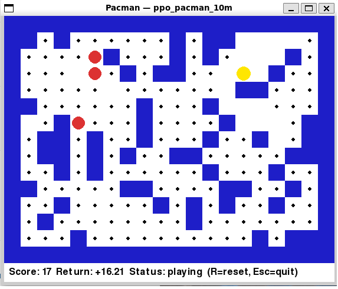

# packrlman

A Pacman. In Python. Because why not.



This is a **funny little vibe-coding project** — the kind of thing that starts with "I wonder if..." at 11pm and ends with a committed repo. No deadlines, no stakeholders, no JIRA. Just dots, ghosts, and a yellow circle that dies a lot.

The entire codebase was developed with [Claude Opus 4.7](https://www.anthropic.com/claude) via Claude Code — pair-programming with an LLM, one commit at a time.

## What it is

- A perfectly serviceable Pacman clone with procedurally generated mazes.
- A headless game core (`game/core.py`) that knows nothing about pixels.
- A pygame shell (`game/pygame_app.py`) that paints the pixels.
- A `to_tensor()` method sitting there suspiciously, doing nothing yet.

## What it will be (eventually, maybe, probably)

A playground for **reinforcement learning**.

The game is already built for it — deterministic seeded RNG, atomic `step(action) → (state, reward, done)` semantics, a `(4, H, W)` tensor encoding of the world, and reward constants (`DOT_REWARD`, `WIN_BONUS`, `LOSS_PENALTY`, `TIME_PENALTY`) just waiting to shape a policy gradient. One of these days an agent is going to learn to eat dots better than me. That's the dream.

Until then: arrow keys. R to restart. Esc to quit.

## Run it

```bash
pip install -r requirements.txt
python main.py
```

## Test it

```bash
pytest
```

## Train an agent

The game is now wrapped as a `gymnasium` env (`game/gym_env.py`) with a PPO
training script. Install the extra deps first:

```bash
pip install -r requirements-rl.txt
python -m rl.train_ppo --timesteps 500000 --n-envs 8
python -m rl.eval --model ppo_pacman --episodes 50
python -m rl.play --model ppo_pacman          # watch it play in the pygame window
```

CPU is fine — at a 20×15 board the bottleneck is env stepping, not the
network. TensorBoard logs land in `./tb/`.

## Pretrained agents

Don't feel like waiting for millions of training steps? Grab a pretrained
checkpoint from the [v0.1.0 release](https://github.com/thalwinli/packrlman/releases/tag/v0.1.0):

| Model | Training budget |
|-------|-----------------|
| `ppo_pacman_1m.zip` | 1M steps — basic dot-collection |
| `ppo_pacman_3m.zip` | 3M steps — reasonable play |
| `ppo_pacman_10m.zip` | 10M steps — strongest |

```bash
gh release download v0.1.0 -p 'ppo_pacman_*.zip'
python -m rl.play --model ppo_pacman_10m          # watch it play
python -m rl.eval --model ppo_pacman_10m          # score it over 50 episodes
python -m rl.train_ppo --resume ppo_pacman_10m.zip --timesteps 2000000  # keep training
```

Strip the `.zip` when passing to `--model`; Stable-Baselines3 adds it back.

## Vibe

If you find a bug, it's a feature. If you find a feature, it's probably a bug. Contributions welcome but emotionally optional.
